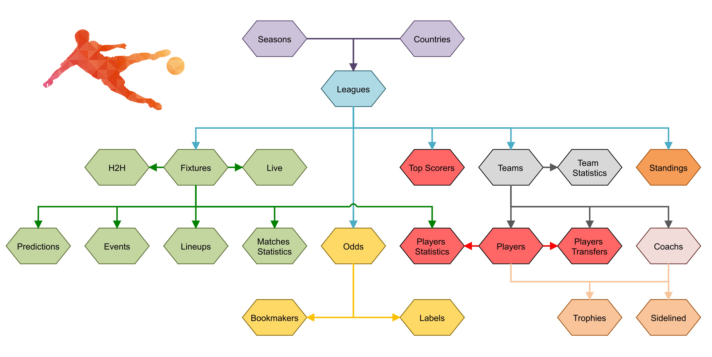
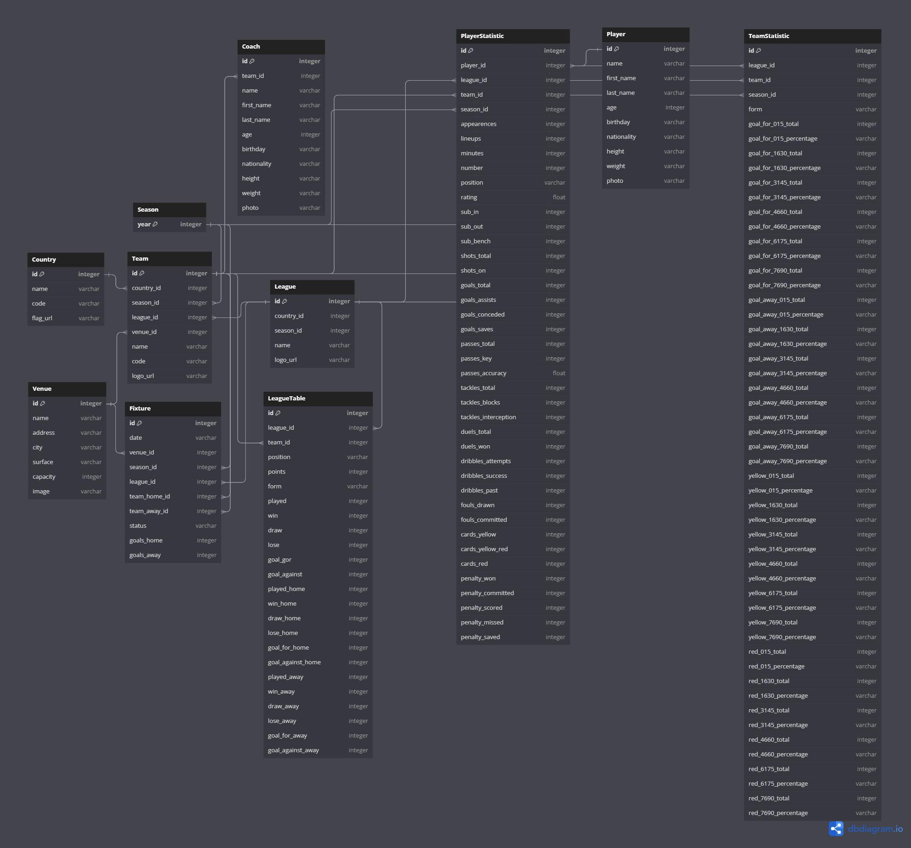

YAISport - проект, содержащий статистику по спортивным событиям, их анализ и предсказания исходов событий и прочих статистических результатов при помощи анализа искуственного интелекта.

Получение данных по средствам API. https://www.api-football.com/

# YAISport
Навигация.
- **core/**
  - templates/
    - include/
  - admin.py
  - apps.py
  - data.py
  - models.py
  - urls.py
  - utils.py
  - urls.py
- **logs/**
  - logfile.log
- **site1/**
  - asgi.py
  - wsgi.py
  - settings.py
  - urls.py
- **static/**
  - css/
  - image/
  - admin/
- manage.py
---
**Схема БД проекта.**

**Диаграмма БД проекта.**

- Просмотреть диаграмму можно по ссылке: https://dbdiagram.io/d/65943cdeac844320ae1ce171
- 
---
1. **Core** - содержит основную логику приложения.
   - **templates** - содержит шаблоны формата HTML, имеет вложенную папку **include**, содержащую вложенные шаблоны.
   - **admin.py** - конфигурация для интерфейса панели администрирования Django.
   - **apps.py** - конфигурация для приложения **core**.
   - **data.py** - содержит класс YAIclient, модуль для обработки задач, связанных с данными. Основная задача - запись данных в БД через API.
     - Методы YAIclient:
       - **Методы ничего не возвращают, производят запись из полученных данных в БД проекта.**
       - **_make_api_request(url)** - метод принимает аргументом эндпоинт для получения данных, возвращает данные в формате json.
       - **get_league(country, season)** - метод для получения данных о спортивной лиге. Принимает аргументы **country** страна, **season** сезон. 
       - **get_standings(league, season)** - метод для получения данных о таблице результатов лиги. Принимает аргументы **league** лига, **season** сезон.
       - **get_team(league, season)** - метод для получения команд. Принимает аргументы **league** лига, **season** сезон. Имеет встроеный метод для получения **Venue** стадиона команды.
       - **get_coach(team)** - метод для получения тренера команды. Принимает аргумент **team** команда.
       - **get_team_statistic(season, team, league)** - метод для получения сезонных показателей команды. Принимает аргументы **season** сезон, **team** команда, **league** лига.
       - **get_player_with_stat(league, team, season)** - метод для получения данных об игроке, а так же его сезонных показателей. Принимает аргументы **league** лига, **team** команда, **season** сезон.
       - **get_fixture(league, date_from, date_to, season)** - метод для получения списка матчей в указанный промежуток времени. Принимает аргументы **league** лига, **date_from & date_to** начало и конец промежутка, **season** сезон.
       - **Методы get_all_...() получают или обновляют данные для **всех** имеющихся в БД проекта стран, лиг и т.д.**
       - **Метод get_all() поочерёдно обновляет данные для всей БД проекта.**
